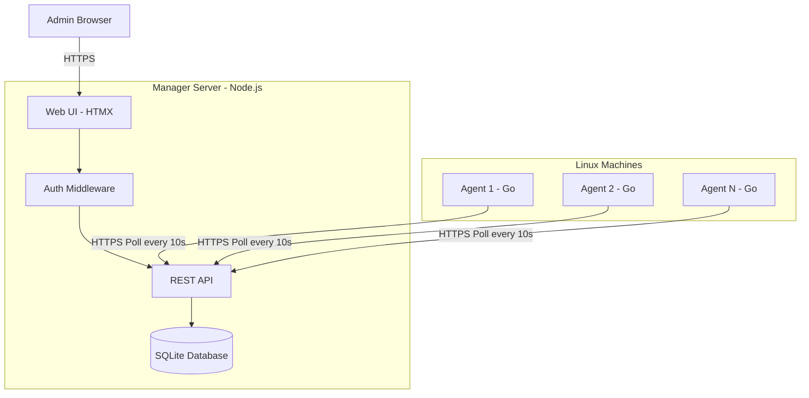
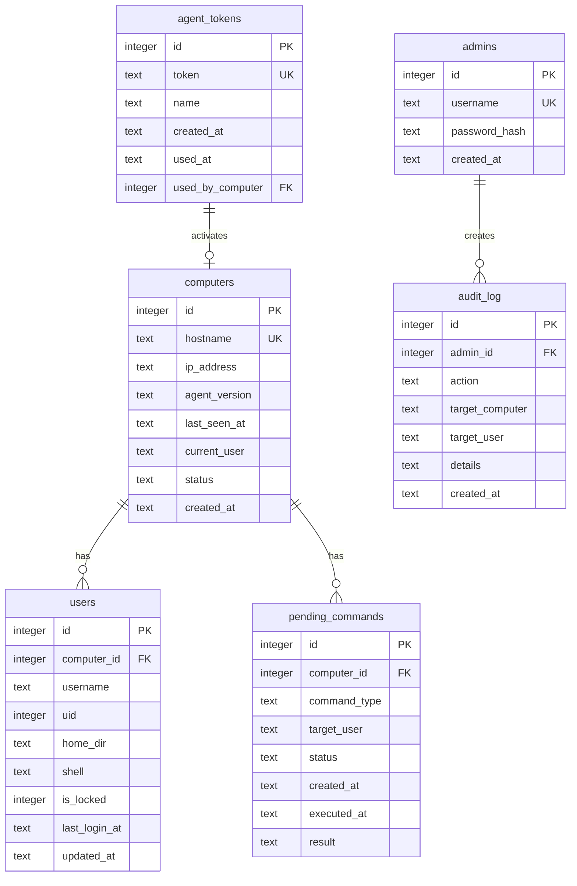
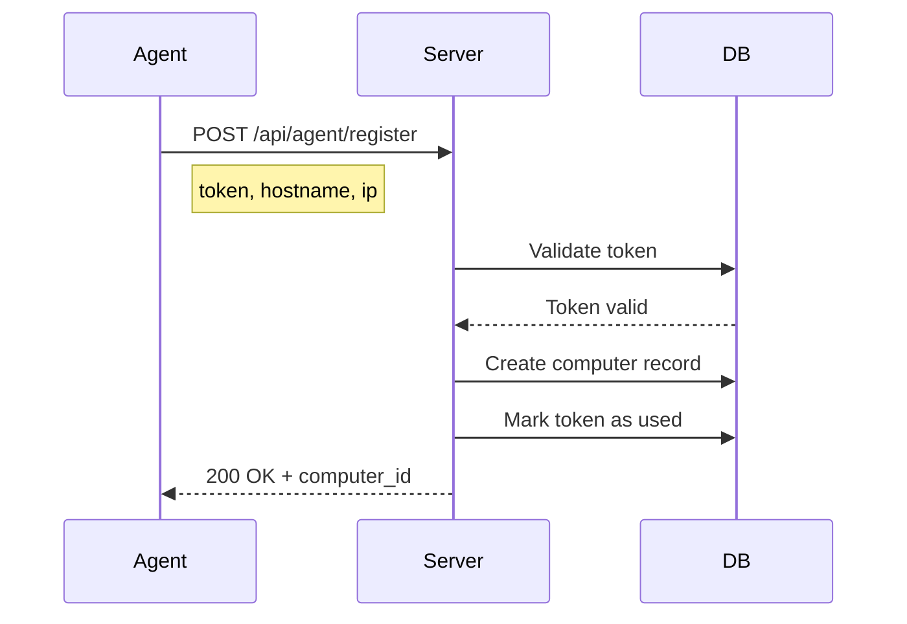
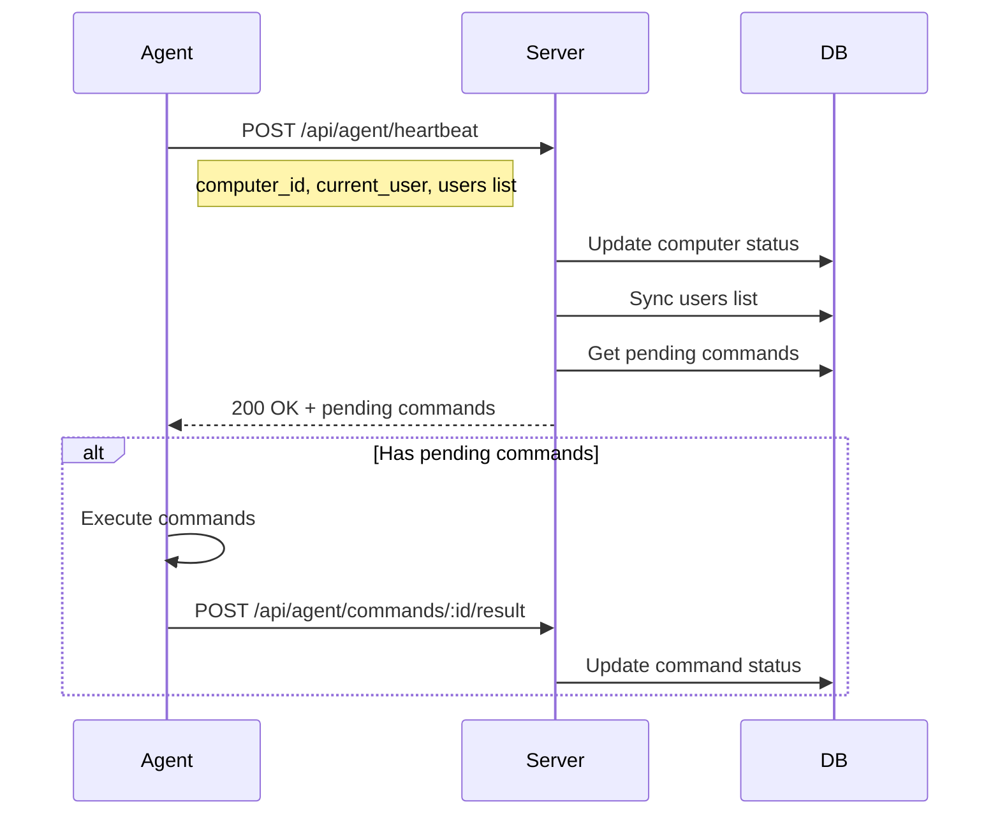

# Linux User Manager - Architecture Plan

## Overview

A web application for managing Linux users across multiple computers. The system consists of:
- **Server**: Node.js + Express + SQLite + HTMX frontend
- **Agents**: Go applications running on managed Linux machines (separate project)

## System Architecture



## Database Schema



## API Endpoints

### Admin Web UI Endpoints

| Method | Endpoint | Description |
|--------|----------|-------------|
| GET | `/` | Dashboard - list of computers with status |
| GET | `/login` | Login page |
| POST | `/login` | Authenticate admin |
| POST | `/logout` | Logout admin |
| GET | `/computer/:id` | Manage specific computer |
| POST | `/computer/:id/user/:username/disable` | Disable user account |
| POST | `/computer/:id/user/:username/enable` | Enable user account |
| POST | `/computer/:id/user/:username/logout` | Force logout user |
| GET | `/tokens` | Manage agent tokens |
| POST | `/tokens/generate` | Generate new agent token |
| DELETE | `/tokens/:id` | Revoke agent token |
| GET | `/audit` | View audit log |

### Agent API Endpoints

| Method | Endpoint | Description |
|--------|----------|-------------|
| POST | `/api/agent/register` | Register agent with token |
| POST | `/api/agent/heartbeat` | Agent heartbeat with status |
| GET | `/api/agent/commands` | Get pending commands |
| POST | `/api/agent/commands/:id/result` | Report command result |

## Agent Communication Protocol

### Registration Flow



### Heartbeat Flow - Every 10 seconds



### Heartbeat Request Payload

```json
{
  "computer_id": 1,
  "hostname": "workstation-01",
  "ip_address": "192.168.1.100",
  "current_desktop_user": "john",
  "users": [
    {
      "username": "john",
      "uid": 1000,
      "home_dir": "/home/john",
      "shell": "/bin/bash",
      "is_locked": false,
      "is_logged_in": true
    },
    {
      "username": "jane",
      "uid": 1001,
      "home_dir": "/home/jane",
      "shell": "/bin/bash",
      "is_locked": false,
      "is_logged_in": false
    }
  ]
}
```

### Heartbeat Response Payload

```json
{
  "status": "ok",
  "commands": [
    {
      "id": 123,
      "type": "disable_user",
      "target_user": "john"
    }
  ]
}
```

### Command Types

| Type | Description | Linux Command |
|------|-------------|---------------|
| `disable_user` | Lock user account | `usermod -L username` |
| `enable_user` | Unlock user account | `usermod -U username` |
| `logout_user` | Force logout user | `pkill -KILL -u username` |

## Project Structure

```
manager/
├── package.json
├── server.js                 # Main entry point
├── config/
│   └── database.js           # SQLite connection
├── middleware/
│   ├── auth.js               # Admin session auth
│   └── agentAuth.js          # Agent token auth
├── routes/
│   ├── index.js              # Dashboard routes
│   ├── auth.js               # Login/logout routes
│   ├── computers.js          # Computer management
│   ├── tokens.js             # Token management
│   ├── audit.js              # Audit log routes
│   └── api/
│       └── agent.js          # Agent API routes
├── models/
│   ├── Admin.js
│   ├── Computer.js
│   ├── User.js
│   ├── Token.js
│   ├── Command.js
│   └── AuditLog.js
├── views/
│   ├── layouts/
│   │   └── main.html         # Base layout
│   ├── partials/
│   │   ├── header.html
│   │   ├── computer-row.html # HTMX partial
│   │   └── user-row.html     # HTMX partial
│   ├── index.html            # Dashboard
│   ├── login.html
│   ├── computer.html         # Manage computer
│   ├── tokens.html           # Token management
│   └── audit.html            # Audit log
├── public/
│   ├── css/
│   │   └── style.css
│   └── js/
│       └── htmx.min.js
├── db/
│   ├── schema.sql            # Database schema
│   └── seed.sql              # Initial admin user
└── utils/
    ├── tokenGenerator.js
    └── logger.js
```

## UI Wireframes

### Dashboard - Computer List

```
┌─────────────────────────────────────────────────────────────────┐
│  Linux User Manager                          [Tokens] [Logout]  │
├─────────────────────────────────────────────────────────────────┤
│                                                                 │
│  Computers                                                      │
│  ┌───────────────────────────────────────────────────────────┐  │
│  │ ● workstation-01    │ Online  │ john    │ [Manage]       │  │
│  ├───────────────────────────────────────────────────────────┤  │
│  │ ● workstation-02    │ Online  │ jane    │ [Manage]       │  │
│  ├───────────────────────────────────────────────────────────┤  │
│  │ ○ workstation-03    │ Offline │ Last: bob, 2h ago        │  │
│  ├───────────────────────────────────────────────────────────┤  │
│  │ ● workstation-04    │ Online  │ -none-  │ [Manage]       │  │
│  └───────────────────────────────────────────────────────────┘  │
│                                                                 │
│  ● Online  ○ Offline                    Auto-refresh: 10s       │
└─────────────────────────────────────────────────────────────────┘
```

### Manage Computer Page

```
┌─────────────────────────────────────────────────────────────────┐
│  Linux User Manager                          [Tokens] [Logout]  │
├─────────────────────────────────────────────────────────────────┤
│  ← Back to Dashboard                                            │
│                                                                 │
│  workstation-01 (192.168.1.100)                    ● Online     │
│  Current User: john                                             │
│                                                                 │
│  Users                                                          │
│  ┌───────────────────────────────────────────────────────────┐  │
│  │ john (1000)  │ ● Logged in │ [Disable] [Logout]          │  │
│  ├───────────────────────────────────────────────────────────┤  │
│  │ jane (1001)  │ ○ Offline   │ [Disable]                   │  │
│  ├───────────────────────────────────────────────────────────┤  │
│  │ bob (1002)   │ 🔒 Locked   │ [Enable]                    │  │
│  └───────────────────────────────────────────────────────────┘  │
│                                                                 │
│  Pending Commands: 0                                            │
└─────────────────────────────────────────────────────────────────┘
```

### Token Management Page

```
┌─────────────────────────────────────────────────────────────────┐
│  Linux User Manager                          [Tokens] [Logout]  │
├─────────────────────────────────────────────────────────────────┤
│  ← Back to Dashboard                                            │
│                                                                 │
│  Agent Tokens                          [+ Generate New Token]   │
│  ┌───────────────────────────────────────────────────────────┐  │
│  │ Token                    │ Status      │ Actions          │  │
│  ├───────────────────────────────────────────────────────────┤  │
│  │ abc123...               │ ✓ Used by workstation-01       │  │
│  ├───────────────────────────────────────────────────────────┤  │
│  │ def456...               │ ✓ Used by workstation-02       │  │
│  ├───────────────────────────────────────────────────────────┤  │
│  │ ghi789...               │ ○ Available  │ [Copy] [Revoke] │  │
│  └───────────────────────────────────────────────────────────┘  │
│                                                                 │
│  New Token Generated:                                           │
│  ┌───────────────────────────────────────────────────────────┐  │
│  │  xyz-abc-123-def-456                              [Copy]  │  │
│  │  Use this token when installing the agent                 │  │
│  └───────────────────────────────────────────────────────────┘  │
└─────────────────────────────────────────────────────────────────┘
```

## Technology Stack

| Component | Technology | Reason |
|-----------|------------|--------|
| Backend | Node.js + Express | Lightweight, good for real-time |
| Database | SQLite | Simple, no separate server needed |
| Frontend | HTMX | Minimal JS, server-rendered HTML |
| CSS | Simple custom CSS | Keep it lightweight |
| Auth | express-session + bcrypt | Simple session-based auth |
| Agent | Go (separate project) | Efficient, single binary |

## Security Considerations

1. **HTTPS Required**: All communication must be over HTTPS
2. **Token Security**: Agent tokens are single-use and should be long random strings
3. **Password Hashing**: Admin passwords hashed with bcrypt
4. **Session Security**: HTTP-only cookies, secure flag in production
5. **Input Validation**: Sanitize all inputs from agents and web UI
6. **Rate Limiting**: Consider rate limiting agent endpoints

## HTMX Integration Points

1. **Dashboard auto-refresh**: Poll every 10 seconds for computer status updates
2. **User actions**: Disable/Enable/Logout buttons trigger HTMX POST requests
3. **Token generation**: Generate token without full page reload
4. **Partial updates**: Update individual computer rows without refreshing entire page

## Implementation Order

1. Project setup and dependencies
2. Database schema and models
3. Admin authentication
4. Agent token management
5. Agent API endpoints
6. Dashboard UI
7. Computer management UI
8. Audit logging
9. Testing and refinement
